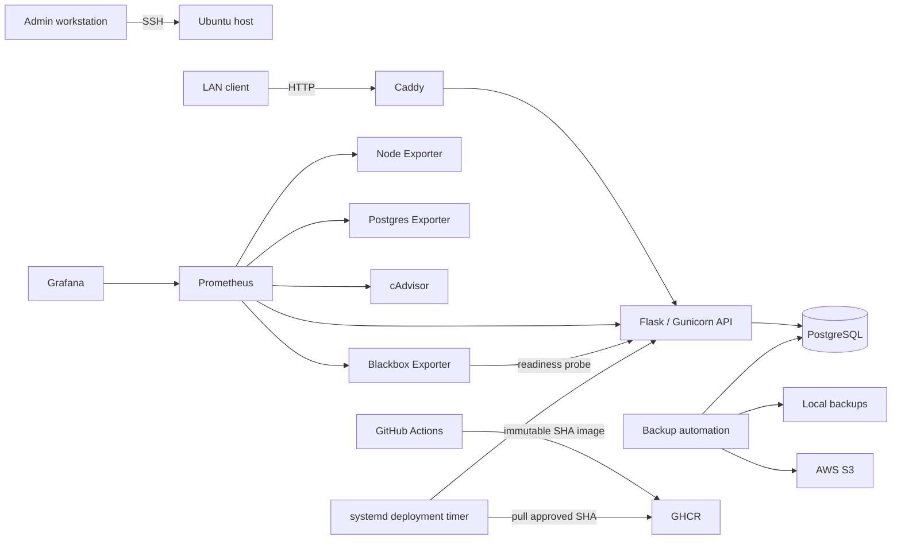

# Platform Lab

A self-hosted platform engineering lab running on Ubuntu, built to explore the operational concerns behind deploying and maintaining containerised services.

The project combines container orchestration, immutable-image CI/CD, host recovery, health-aware deployment, observability, PostgreSQL backup and recovery, container hardening, network segmentation, AWS backup infrastructure, and configuration automation.

## Architecture



## Platform

Nine Docker Compose services are separated across `edge`, `backend`, and `monitoring` networks:

- Caddy
- Flask/Gunicorn API
- PostgreSQL
- Prometheus
- Grafana
- Blackbox Exporter
- Node Exporter
- PostgreSQL Exporter
- cAdvisor

PostgreSQL is not published to the host. Prometheus and Grafana bind only to loopback, while Caddy provides LAN ingress to the application.

## CI/CD

GitHub Actions validates changes before an application image is released. CI includes application tests, dependency/security checks, container building, and Trivy image vulnerability scanning.

Successful images are published to GHCR using the Git commit SHA as an immutable tag.

Deployment is pull-based. A systemd timer checks `origin/main`, verifies that the corresponding immutable image exists, deploys that exact image, and waits for application readiness.

If the image is unavailable, the existing deployment remains untouched. Deployment logic also supports rollback when a replacement does not become healthy.

## Reliability

The Compose stack is reconciled through systemd after networking and Docker become available.

This ordering was introduced after diagnosing a real boot race where Caddy attempted to bind the host LAN address before the interface had acquired it. The corrected startup sequence was subsequently validated across a host reboot.

Deployment and backup automation are also operated through systemd services and timers.

## Observability

Prometheus collects application, host, PostgreSQL, container, and readiness telemetry.

Grafana provides dashboards over Prometheus data.

Blackbox Exporter probes `/health/ready`. The API readiness endpoint performs a PostgreSQL dependency check, while `/health/live` remains independent of database health.

This provides externally observed readiness rather than relying on a potentially stale application-side readiness gauge.

## Backup and Recovery

PostgreSQL backups are automated through systemd and include local backup creation, validation, checksums, retention, and upload to private AWS S3 storage.

AWS backup infrastructure is represented as OpenTofu configuration under `infrastructure/aws`.

Recovery was empirically tested using an isolated database. A real backup was restored and queried successfully while the production readiness endpoint remained healthy, after which the temporary database was removed.

See [Restore Validation](docs/restore-validation.md).

## Security

The API container runs with:

- a non-root user
- a read-only root filesystem
- writable temporary storage where required
- all Linux capabilities dropped
- `no-new-privileges`
- no Docker socket
- no privileged mode

The host firewall uses a default-deny incoming policy with SSH explicitly permitted.

PostgreSQL and the monitoring exporters are not host-published. Prometheus and Grafana are loopback-only.

CI rejects HIGH and CRITICAL Trivy image findings. During validation, a build was blocked by newly detected Debian package vulnerabilities with available fixes. The image was remediated by applying the security updates rather than suppressing the findings.

See [Security Validation](docs/security-validation.md).

## Infrastructure as Code

The repository uses:

- **Docker Compose** for service orchestration and network segmentation
- **systemd** for boot reconciliation, deployment automation, and backups
- **OpenTofu** for AWS backup infrastructure
- **Ansible** for host configuration
- **GitHub Actions** for CI and image publication

## Repository Structure

```text
.
├── ansible/              # host configuration
├── app/                  # API, tests and container image
├── caddy/                # reverse proxy
├── docs/                 # architecture, operations and validation
├── infrastructure/aws/   # OpenTofu AWS infrastructure
├── monitoring/           # Prometheus, Grafana and Blackbox
├── scripts/              # deployment and backup automation
├── systemd/              # host services and timers
├── compose.yaml
└── .env.example
```

## Documentation

- [Architecture](docs/architecture.md)
- [Operations Runbook](docs/operations-runbook.md)
- [Restore Validation](docs/restore-validation.md)
- [Security Validation](docs/security-validation.md)

## Scope

Platform Lab is intentionally a **single-host homelab**, not a highly available production cluster.

The current scope does not include Kubernetes, multi-node orchestration, public DNS, project-managed TLS, distributed tracing, centralised log aggregation, or zero-downtime deployment.

The focus is on implementing and understanding the underlying platform concerns before adding additional orchestration layers.
